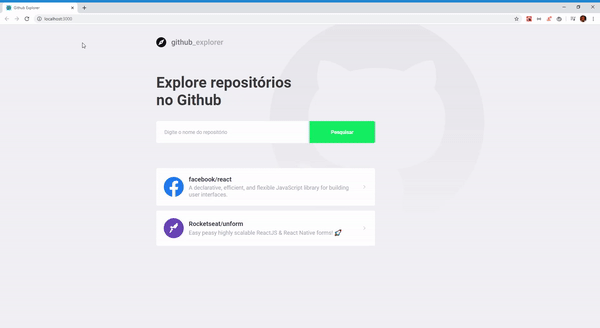
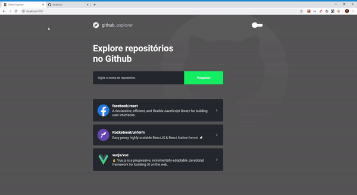

<h3 align="center">
  Github Explorer
</h3>

  

  

  

  <a href="#rocket">Sobre o projeto</a>&nbsp;&nbsp;&nbsp;|&nbsp;&nbsp;&nbsp;
  <a href="#memo-licença">Licença</a>

## :rocket: Sobre

Uma aplicação aonde é possivel buscar um repositório no github e ver alguns detalhes desse repositorio, como sua lista de issues abertas.

Para executar o projeto basta dar um `git clone https://github.com/tiagofsv95/github-explorer.git` no seu console e depois `yarn` para instalar as dependencias. Depois de instalar todas as dependencias basta executar `yarn start`.

## Ferramentas utilizadas na aplicação

-**react**;

-**axios**;

-**react-icons**;

-**styled-components**;

-**typescript**;

-**eslint**;

-**prettier**;

### Funcionalidades da aplicação

- **`Adicionar um repositório válido do github`**: Deve ser capaz de adicionar em uma lista, os repositorios validos encontrados no github.

- **`Ver detalhes de um repositório`**: Ao clicar no repositório é possivel ver detalhes do repositorio, e uma lista com suas issues.

Dark Mode Implemented!

## :memo: Licença

Esse projeto está sob a licença MIT. Veja o arquivo [LICENSE](LICENSE) para mais detalhes.

---

Feito com ❤️ by Tiago Felipe
